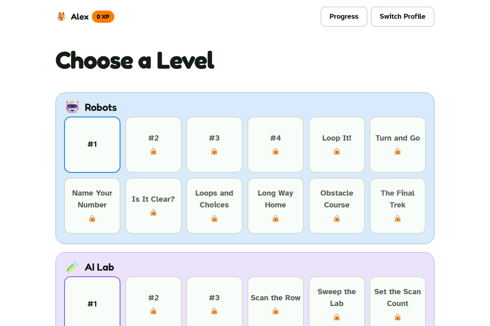

# CodeTrek

A free, open-source coding journey for kids — starting from icon-only puzzles
a pre-reader can play, growing into text-labeled block coding, and eventually
toward real code. Built for two kids, shared in case it's useful for yours.

[](https://github.com/SikamikanikoBG/codetrek/actions/workflows/ci.yml)
[](LICENSE)
[](https://hub.docker.com/r/sikamikaniko123/codetrek)



## What it is

- **One continuous journey, not separate apps.** The same [Google Blockly](https://developers.google.com/blockly)
  editor scales from an icon-only toolbox (no reading required) to
  text-labeled blocks covering loops, conditionals, variables, and functions.
- **Teaches, doesn't just test.** **Buddy**, an on-screen companion, notices
  when a level isn't clicking — after a few failed tries it surfaces a hint,
  and if that's still not enough, offers a short, animated explanation of the
  underlying concept (what a loop actually *is*, not just "try again").
- **Gamified progress.** XP, stars, badges, and a Progress view spanning
  multiple themed Worlds (Robots, AI Lab, more to come).
- **Bilingual by construction.** English and Bulgarian, switched per profile
  (not browser locale) — icon-tier levels use zero text by schema, so a
  pre-reader's experience can never silently break on a missing translation.
- **Works everywhere.** Touch and mouse, desktop and mobile.
- **No account required.** Local profiles live in the browser. An optional,
  privacy-respecting sync (a 6-character link code, no email/password) lets a
  profile hop between a kid's own devices.

## Tech stack

React + TypeScript + Vite, Google Blockly for the visual editor, a sandboxed
JS-Interpreter driving a robot-grid scenario engine, react-i18next for EN/BG,
and a small optional Express + SQLite backend (`server/`) purely for
cross-device profile sync — everything else is static and runs entirely in
the browser.

## Running locally

```bash
npm ci
npm run dev        # http://localhost:5173
```

Optional sync backend (only needed to test cross-device linking):

```bash
cd server && npm ci && npm run dev   # http://localhost:4000
```

### Tests & checks

```bash
npm run build       # tsc + vite build
npx vitest run       # unit tests
npm run lint         # oxlint
```

## Docker

```bash
docker build -t codetrek .
docker run -p 8080:80 codetrek
```

`docker-compose.yml`/`nginx.conf` examples for a self-hosted deploy (with the
optional sync backend as a sidecar service) live in [`deploy/`](deploy/).

## Roadmap

- **Phase 2:** real, runnable, editable Python via Pyodide (WASM CPython) —
  no server-side code execution.
- **Phase 3:** an AI-assistant-fluency track (working with Claude/ChatGPT/a
  local LLM as a coding partner).
- **Phase 4:** accounts, more Worlds, mobile app packaging.

## Contributing

Issues and PRs welcome — this is a small, actively-used project rather than
a polished product with a roadmap team, so response times vary. See
[`CONTRIBUTING.md`](CONTRIBUTING.md) if you'd like to add a level, a
translation, or a new World.

## License

MIT — see [LICENSE](LICENSE).
